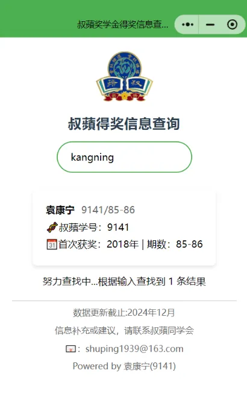
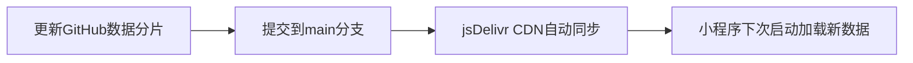

# 叔蘋奖学金查询小程序

[](https://github.com/yourname/scholarship-miniprogram/blob/main/LICENSE)


本小程序是基于原 GitHub Pages 项目 ([scholarship-query](https://github.com/kangningyuan/scholarship-query)) 迁移而来的微信小程序版本。




现已上线微信，扫描下面二维码即可使用：


## 技术亮点 ✨

### 🚀 CDN 分片加载技术
- 采用 jsDelivr CDN 加速全球访问
- 数据分片并行加载，单分片平均大小20K
- 自动缓存控制策略（通过 URL 时间戳参数）

### ⚡ 核心功能
- 首屏加载时间 < 1.5s 
- 支持 1W+ 条记录的即时搜索
- 智能拼音匹配
- 防抖优化（400ms 延迟触发）

## 迁移改造 🛠

| 原方案                  | 小程序方案                |
|-------------------------|-------------------------|
| 浏览器 Fetch API        | 微信 wx.request         |
| CDN 分片加载            | CDN 分片加载           |
| DOM 操作更新结果        | setData 数据绑定       |


## 使用说明 📖

### 开发环境搭建
```bash
# 克隆仓库

# 微信开发者工具 -> 导入项目
```


## 数据更新机制 🔄

### CDN 同步流程



## 注意事项 ⚠️

1. **域名白名单配置**
   - 在小程序后台添加相应的CDN缓存的地址 `cdn.jsdelivr.net` 到 request 合法域名

2. **代码包优化**
   - 主包大小需控制在 2MB 以内
   - 建议开启微信开发者工具的 "压缩代码" 选项

3. **数据安全**
   - 敏感字段在前端进行脱敏处理
   - 建议添加访问频率限制


## 联系 📞

> 项目维护者：袁康宁(9141)--上海叔蘋同学会IT组  
> 📧: yuankangning@outlook.com  
